## Janji

Saya Lyan Nazhabil Dzuquwwa dengan NIM 2308428 mengerjakan Latihan Modul 1 dan Tugas Praktikum 1 dalam mata kuliah Desain dan Pemrograman Berorientasi Objek untuk keberkahanNya maka saya tidak melakukan kecurangan seperti yang telah dispesifikasikan. Aamiin.

## Desain Program

Program ini memiliki 1 Class, yaitu PetShop dengan Atribut berikut:
- id
- namaProduk
- kategoriProduk
- hargaProduk
- fotoProduk

Additional Notes: Untuk fotoProduk di CPP hanya menampilkan 1 atau 0. Di Java dan Python, ia hanya menampillkan kata ada atau tidak ada. Untuk di PHP ia akan menampilkan gambar yang nanti di upload.

## Alur Program

Untuk Menjalankan Program, cukup jalankan file main di setiap bahasa, untuk PHP dijalankan di localhost. Program memiliki 6 opsi untuk dapat dipilih:
- Untuk menambahkan data, ketik Opsi `1`
- Untuk menghapus data, ketik opsi `2` lalu input id yang ingin dihapus
- Untuk menampilkan semua data, ketik opsi `3`
- Untuk mencari data berdasarkan Nama, ketik opsi `4`, lalu input nama produk yang ingin dicari. Jika ada banyak data yang memiliki nama yang sama maka akan return semua data dengan nama tersebut
- Untuk mengubah data ketik opsi `5` lalu input id yang ingin diubah
- Untuk keluar dari program , ketik opsi `6`

Ada aturan khusus untuk atribut id:
- id bersifat unique, sehingga tidak boleh ada id yang nilainya sama
- untuk menghapus dan mengubah data perlu menggunakan nilai id pada data yang ada, jika id yang dimasukkan tidak ada di data maka tidak akan melakukan apa-apa

Note: Untuk PHP, user tidak dapat input data melalui form atau semacamnya

## Dokumentasi

### CPP
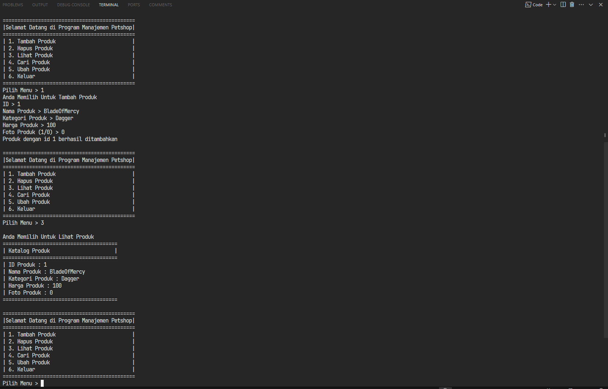
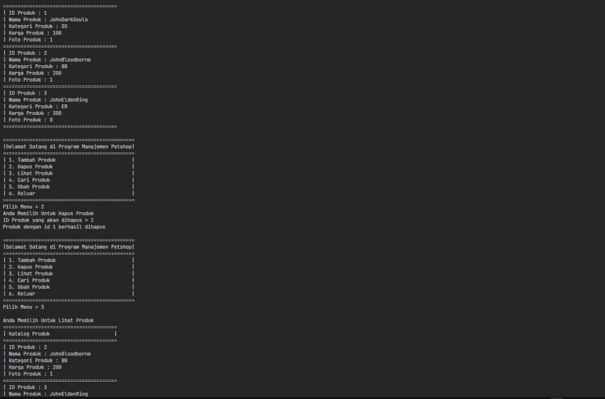
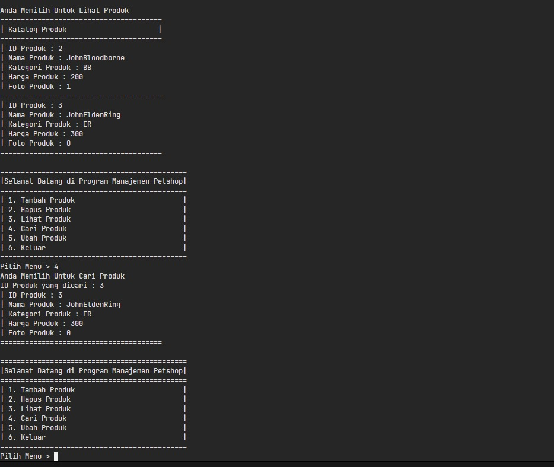
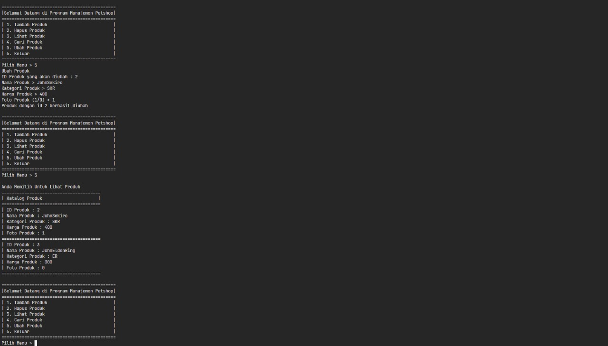
P.S. : Untuk cpp ada kesalahan teknis, jadi yang mencari malah memakai pencarian id sehingga input yang dimasukkan berupa id (i forgor)

### Java
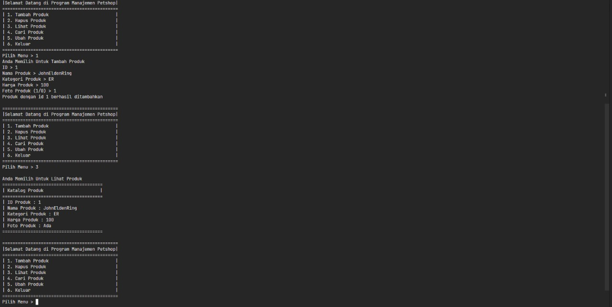
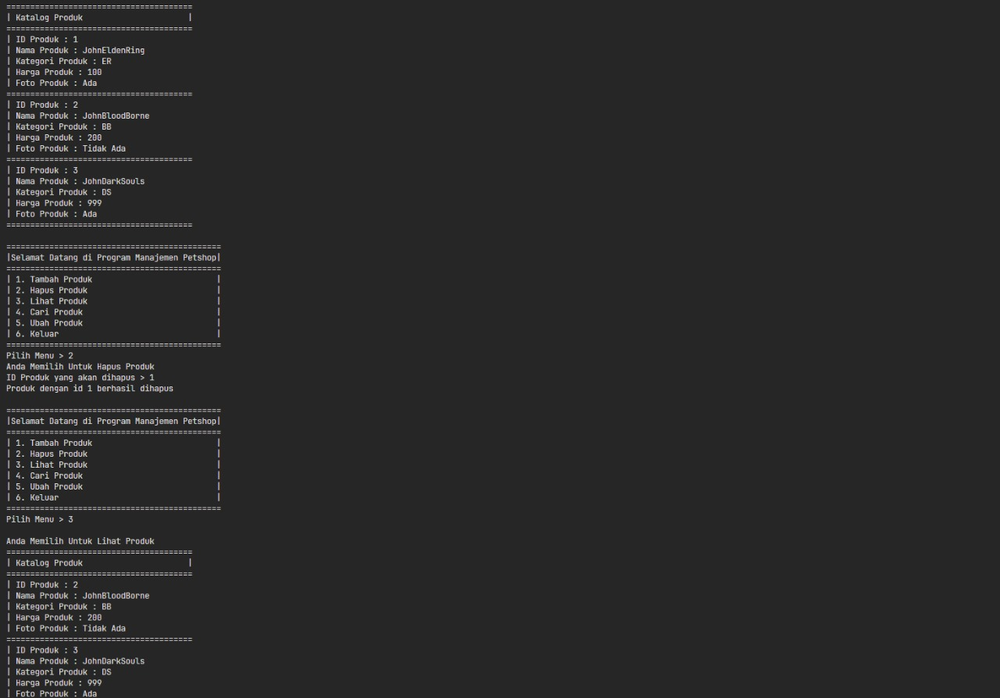
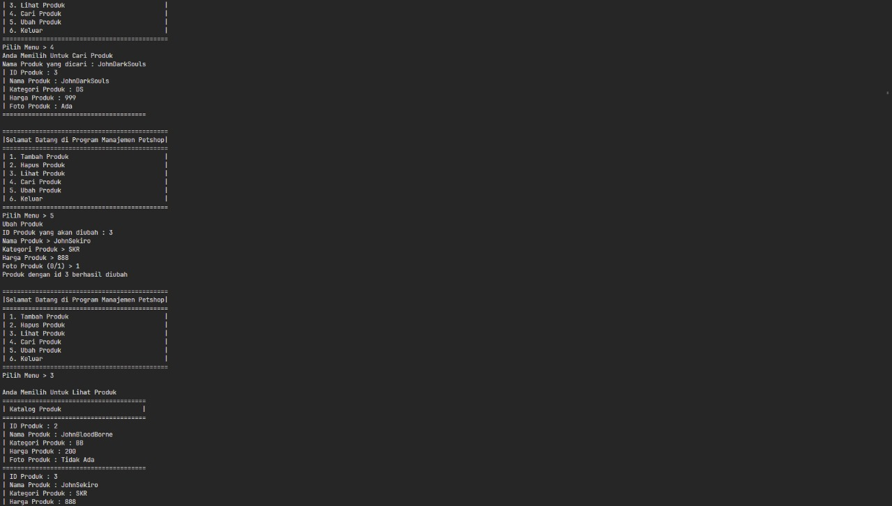

### Python
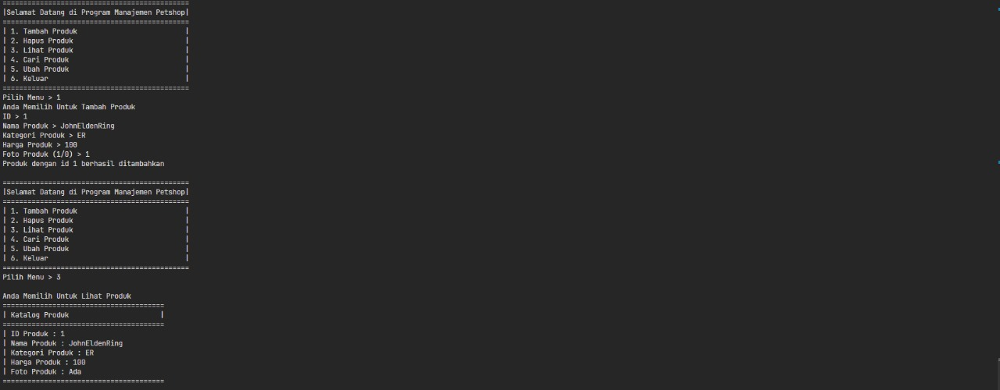
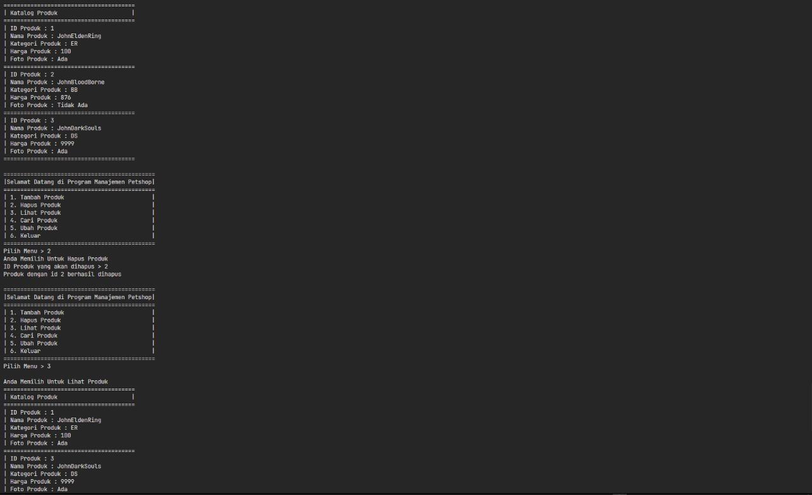
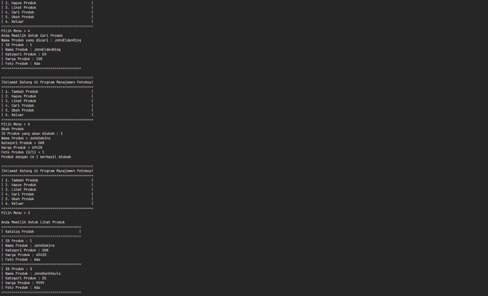

### PHP
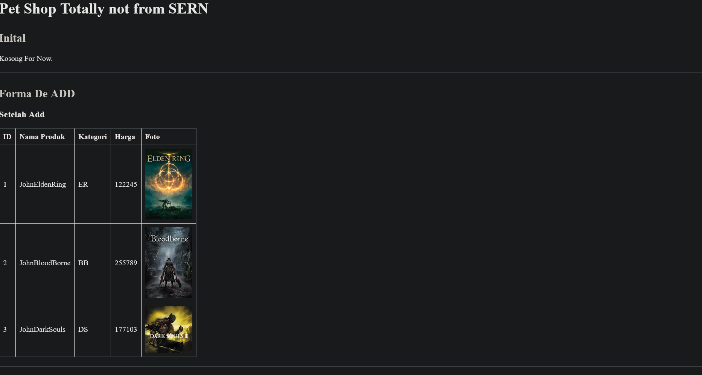
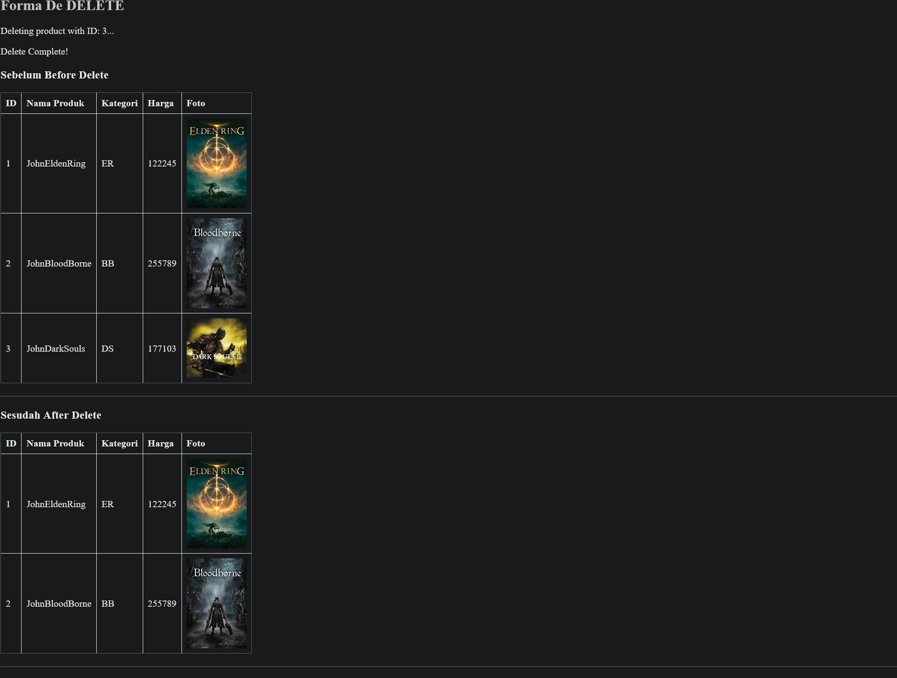
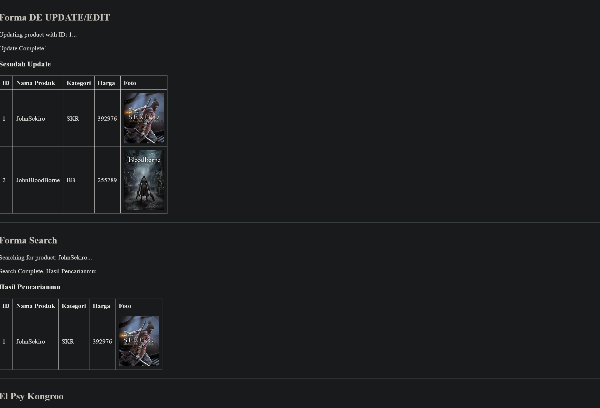